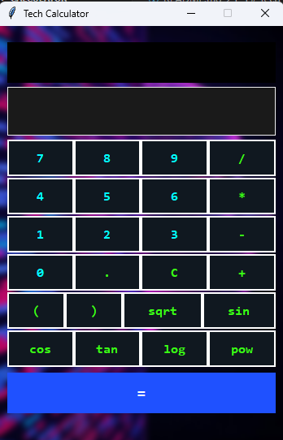

# Tech-Themed Python Calculator

A sleek, advanced calculator with a futuristic tech-inspired GUI built using Python, Tkinter, and Pillow.

---

## Screenshot



## Features

- **Modern tech theme** with neon cyan, green, and royal blue colors
- **Blurry background image** for a polished look (requires `background.jpg`)
- **Basic and scientific calculations** (supports `sqrt()`, `sin()`, `cos()`, `tan()`, `log()`, `pow()`)
- **Calculation history** showing last 3 expressions
- **Keyboard input support** (digits, operators, Enter to calculate, Backspace to delete)
- Responsive and visually appealing interface

---

## Installation

### Prerequisites

- Python 3.x installed (download from [python.org](https://www.python.org/downloads/))
- [Pillow](https://python-pillow.org/) library for image processing

Install Pillow via pip:

```bash
pip install pillow
```

## Setup

- Clone or download this repository.

- Place a tech-themed background image named background.jpg in the project folder.
The image will be resized and blurred automatically.

## Usage

Run the calculator with:
```
python pink_calculator.py
```

## How to Use

- Click buttons or type on your keyboard to enter expressions.
- Supported operators: +, -, *, /, (, ), and scientific functions:
    - sqrt(x) - square root
    - sin(x), cos(x), tan(x) - trigonometric functions (radians)
    - log(x) - natural logarithm
    - pow(x, y) - power function

- Press = button or hit Enter to evaluate.
- Use C button to clear the current input.
- Backspace key deletes the last character.
- Calculation history appears below the display.

## Customization

- Change the background image by replacing background.jpg.
- Adjust colors and fonts by editing pink_calculator.py.
- Add more scientific functions by expanding the eval environment.

## Known Issues

- Transparency effects in Tkinter are limited; background blur is static.
- Scientific functions expect input in radians.
- No error handling for invalid scientific input (e.g., log(-1)).

## License

This project is under the MIT License and is free to use 

## AUTHOR

Built with ❤️ by Nomanguni Khumalo

Inspiration from tech UI color schemes and calculator designs

